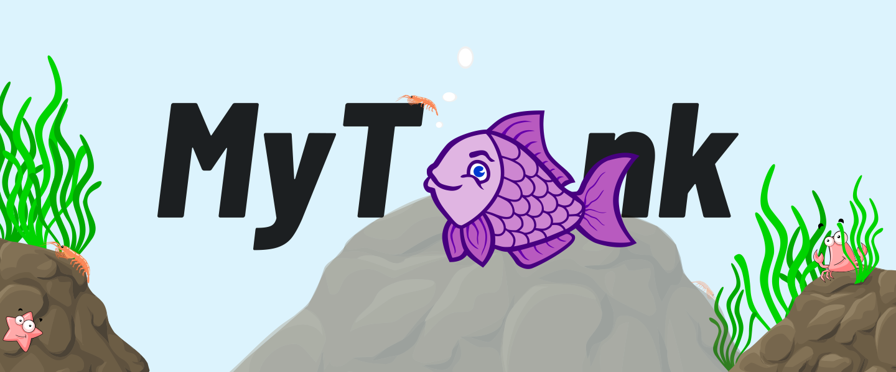
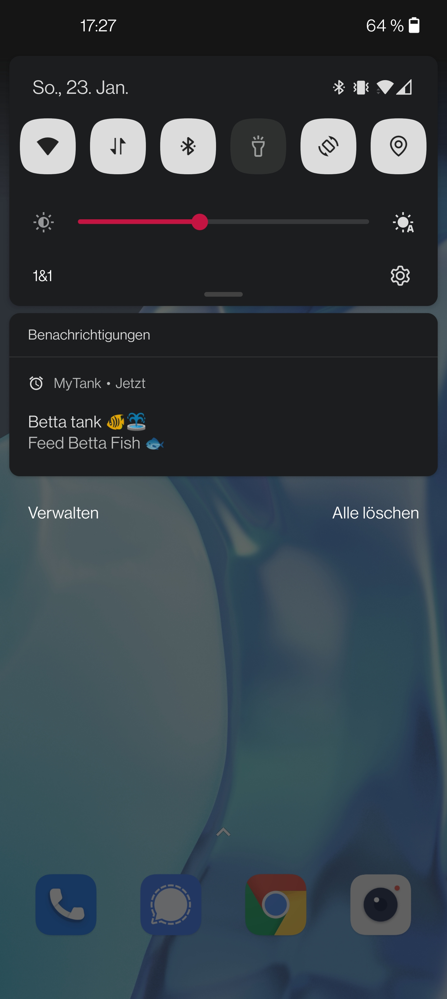
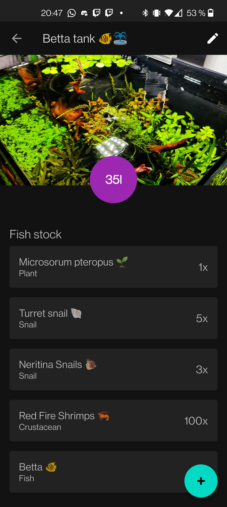
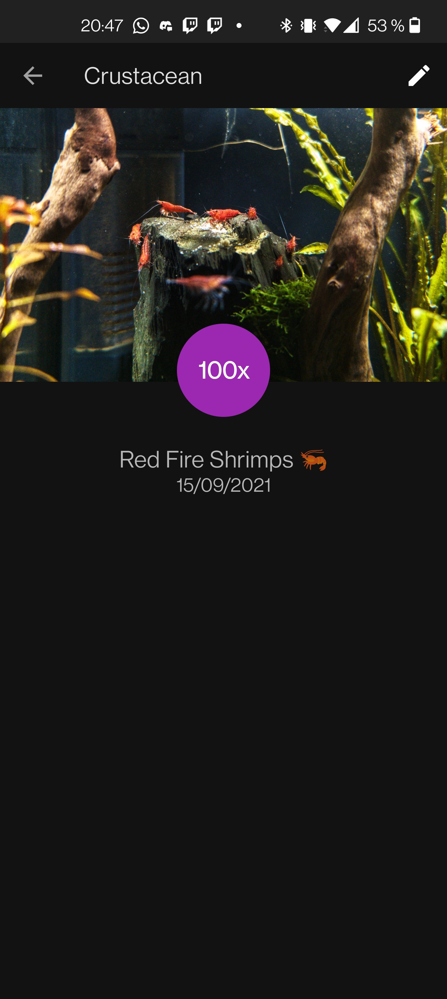
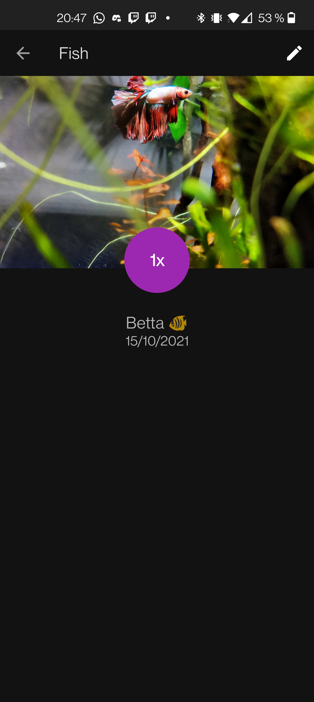
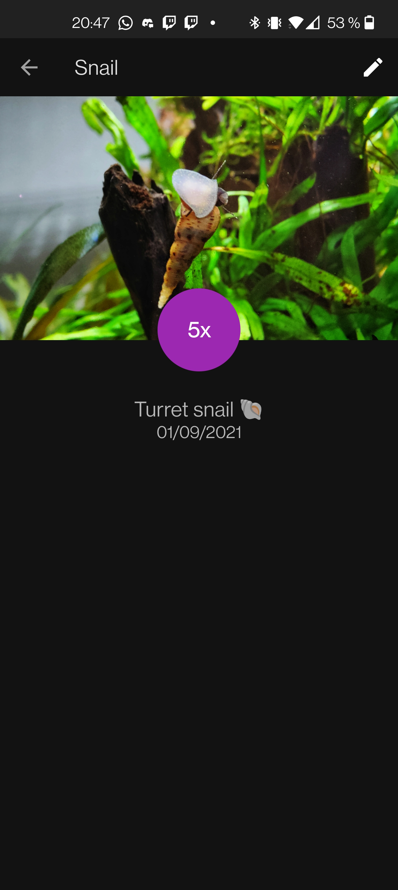
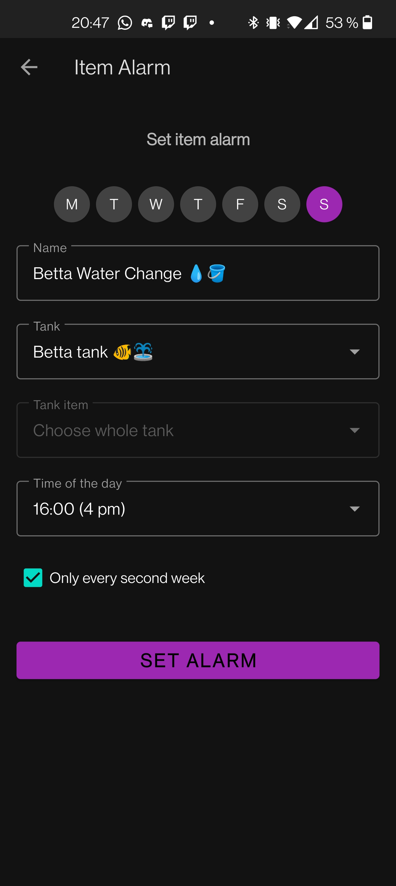
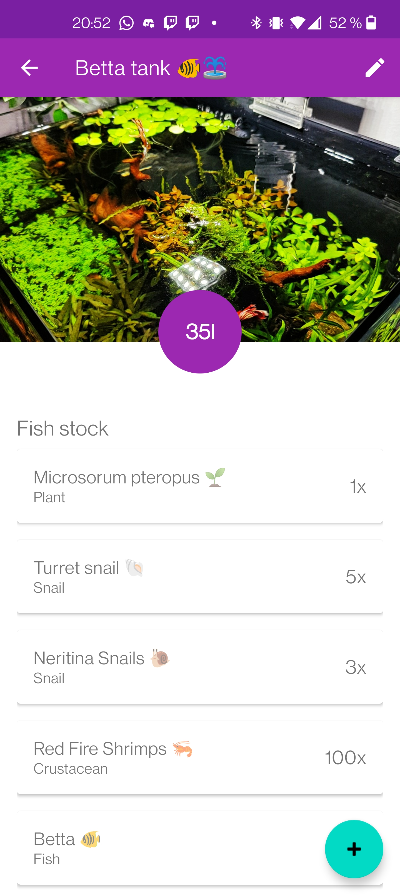

# MyTank App - The Fish Tank Manager

## Why?
With MyTank you can manage all your aquariums. Add your snails, shrimp, fish and even plants and create various reminders.
You can create feeding reminders for animals, alarms for whole aquariums (e.g. water change) or even fertilizer alarms for plants!

## Features
- Register/Login Methods
    - Email/Password (with reset password functionality)
    - Google Auth
    - Anonymously
- Add/Update/Delete Fish Tanks
    - With image upload
- Add/Update/Delete Tank Items
    - With image upload
- Add/Update/Delete Alarms for Tanks and for Tank Items
    - Alarms are synchronized across devices
    - Reminders work even after a reboot without starting the app
    - They can be configured repeatedly for each day/hour, ...
- Night/Light mode
    - Can be set to "System" as of Android 10
    - Default is Night mode

## Technical Features
- Use of Firebase
    - Firebase Authentication
    - Cloud Firestore
    - Firebase Storage
- Kotlin Coroutines
    - For async/await Firebase data
- BroadcastReceiver
    - Hourly BroadcastReceiver
    - On Boot BroadcastReceiver
- Applied MVVM (Model View ViewModel) Pattern
- SplashScreen to load data

## Screenshots
### Alarm Notification

### Splashscreen

### Tank View

### Tank Item: Shrimps

### Tank Item: Betta

### Tank Item: Turret snail

### Item Alarms: Overview

### Item Alarms: Edit Alarm

### Light Mode

## References
- Firebase: https://firebase.google.com/docs/firestore/quickstart
- Google SignIn: https://firebase.google.com/docs/auth/android/google-signin
- Coroutines: https://developer.android.com/kotlin/coroutines